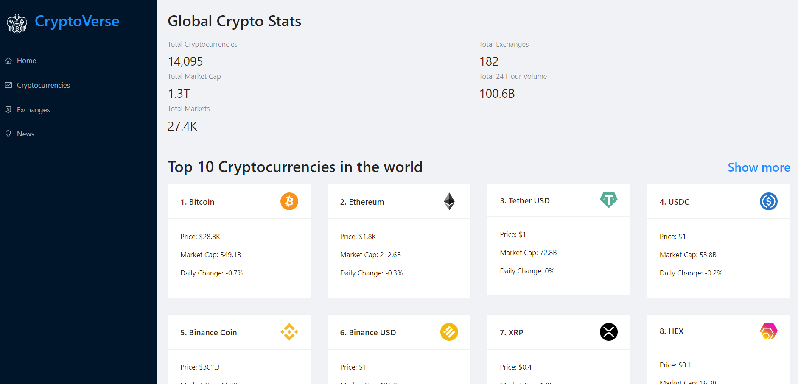

# CryptoVerse - Discover the world of cryptocurrencies

CryptoVerse is a web application that displays real-time data and news about cryptocurrencies.  
Made with React, AntDesign, and Chart.js.  
Fetches data from CoinRanking API and Bing News Search API.  
- News articles can be sorted by coin names.  
- Price chart of a coin can be viewed by clicking on it's card.

See the website [LIVE](https://cryptoverse22.netlify.app/).
  

### Screenshot:  

